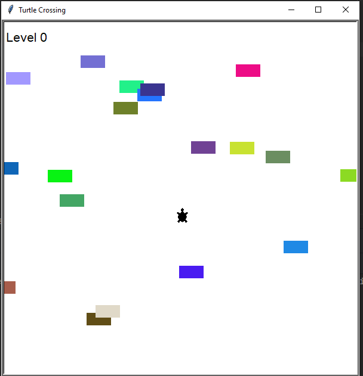

# 🐢 Turtle Crossing Game

In this game, you control a turtle that must cross a busy road filled with moving cars.  
Each time you reach the top safely, you level up and the cars move faster!
---
 
---
## ✨ Features
- Move the turtle **up**, **down**, **left**, and **right** using the `W`, `A`, `S`, `D` keys.
- Cars appear randomly and move from right to left across the screen.
- Each new level increases the speed of the cars.
- Game over screen when the turtle collides with a car.
- Press `Space` to restart the game after a game over.

## 🧠 Why I Built This
I created this project to practice Python's object-oriented programming concepts and improve my skills with the `turtle` graphics library.  
It was also a fun way to challenge myself by combining movement, collision detection, and game loop logic.  
Building a complete, playable game from scratch helped me learn and enjoy coding even more!

## 🎮 How to Play
- Use:
  - `W` key to move **up**.
  - `S` key to move **down**.
  - `A` key to move **left**.
  - `D` key to move **right**.
- Avoid getting hit by cars.
- Reach the top of the screen to pass to the next level.
- Press `Space` to restart if you lose.

## 🛠️ How to Install
1. Make sure you have **Python 3.x** installed.
2. Clone or download this repository.
3. Open your terminal or command prompt.
4. Navigate to the project folder.
5. Run the following command:

```bash
clone https://github.com/Juda-Tech-Green/turtle-crossing-py
cd turtle-crossing-py
python main.py
```
## ⚙️ Requirements
- Python 3.x
- No additional packages needed (only the standard `turtle` module).

## 📁 Files
- `main.py` - Main program loop.
- `player.py` - Player (turtle) movement logic.
- `car_manager.py` - Car creation and movement management.
- `scoreboard.py` - Scoreboard display and game over handling.

## 📜 License
MIT © [JuDa](https://github.com/Juda-Tech-Green)
Made with 💚 and Python

